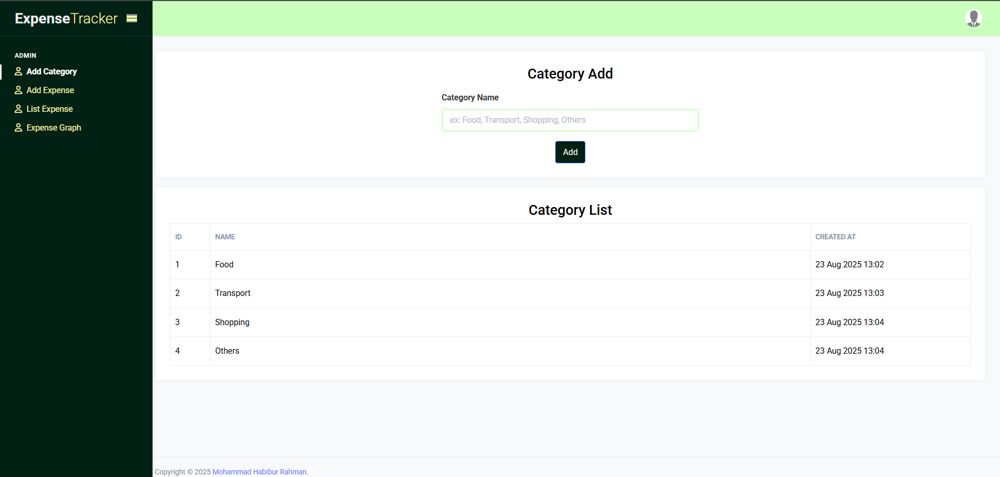
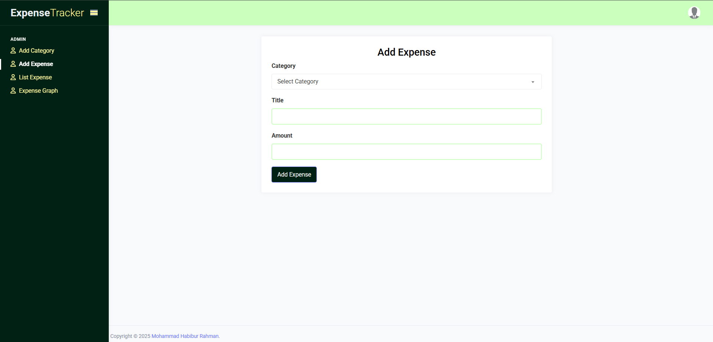
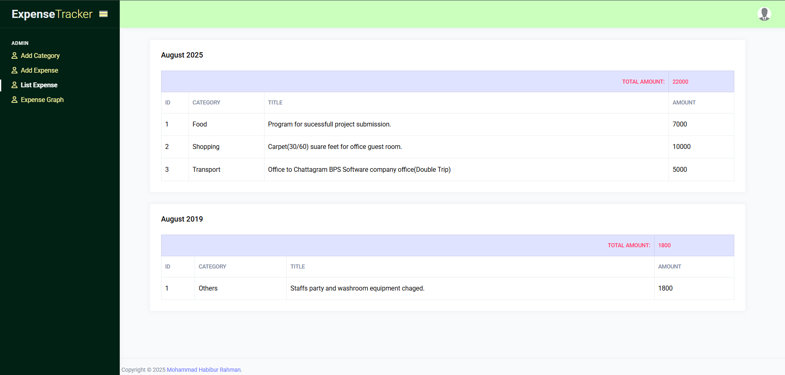
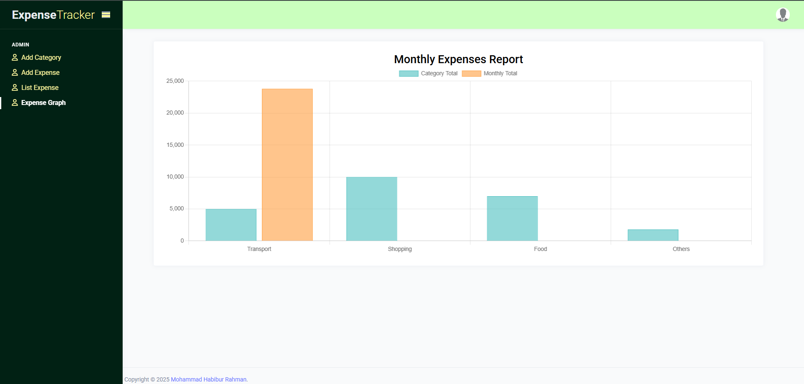

<p align="center"><a href="https://laravel.com" target="_blank"></a></p>

<p align="center">
<a href="https://github.com/laravel/framework/actions"></a>
<a href="https://packagist.org/packages/laravel/framework"></a>
<a href="https://packagist.org/packages/laravel/framework"></a>
<a href="https://packagist.org/packages/laravel/framework"></a>
</p>

# Expense Tracker with Monthly Report

A simple Laravel-based expense tracking system with daily expenses, category management, and monthly summary reports.

## Features
- Add daily expenses (title, amount, date, category)
- Fixed categories: Food, Transport, Shopping, Others
- List all expenses (latest first)
- Monthly report grouped by category
- Authentication for users
- Simple Blade templates

### Screenshots

#### Login Page


#### Admin Dashboard


#### Add Category


#### Add Expense


#### Expense List


#### Expense List



## Requirements
- PHP >= 8.1
- Composer
- MySQL
- Node.js & npm (optional if using frontend assets)

## Installation / Setup

1. Clone the repository:
```bash
git clone https://github.com/habibdiu/expense_tracker_with_monthly_report
cd expense-tracker
